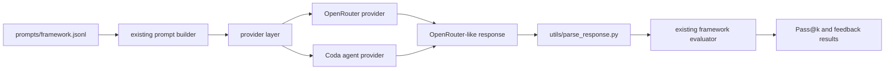

# Plan: Benchmark the Coda Agent on QuanBench+

## Objective

Reconfigure this fork of QuanBench+ so it can benchmark the Coda agent as the code generator. Coda should be treated as a generation provider, not as a fourth quantum framework.

The target framework remains one of:

- `qiskit`
- `cirq`
- `pennylane`

The benchmark should keep the QuanBench+ scoring contract from the paper: run generated code in the target framework, normalize the result to a probability vector, compare against canonical outputs with KL acceptance, and report Pass@k plus feedback-loop repair scores.

References:

- QuanBench+ paper: https://arxiv.org/abs/2604.08570
- Coda API index: https://docs.conductorquantum.com/api-reference/coda-api/llms.txt
- Coda Run Agent docs: https://docs.conductorquantum.com/api-reference/coda-api/agents/run

## Current Repository Shape

QuanBench+ in this fork is organized around framework-specific prompts and evaluators:

- `pass_at_k_pipeline/api_pass_at_k.py` sends model requests through OpenRouter, parses responses, and saves raw generated code.
- `feedback_loop/api.py` sends model requests through OpenRouter, evaluates each attempt, and feeds runtime or wrong-answer feedback back to the model.
- `pass_at_k_pipeline/*_pip/save_*_responses.py` executes generated code and converts framework outputs to probability arrays.
- `pass_at_k_pipeline/*_pip/get_*_results.py` compares model outputs to `canonical_results/canonical_solutions.json` and prints Pass@k summaries.
- `utils/parse_prompt.py` and `utils/parse_prompt_with_feedback.py` build OpenRouter-style chat payloads.
- `utils/parse_response.py` extracts executable Python code from OpenRouter-style responses.

The framework paths expect:

- `prompts/cirq.jsonl`
- `prompts/qiskit.jsonl`
- `prompts/pennylane.jsonl`

Verified: all three files exist in this checkout (`prompts/cirq.jsonl`, `prompts/qiskit.jsonl`, `prompts/pennylane.jsonl`). The benchmark can run end-to-end as soon as the provider layer lands.

## Coda API Surface Needed

For this integration, use only the Coda agent endpoint:

- `POST https://api.conductorquantum.com/v0/coda/agents`
- Auth: `Authorization: Bearer <CODA_API_KEY>`
- Request fields from the docs:
  - `messages`: list of `{role, content}` entries
  - `mode`: `build`
  - `fast`: optional boolean
  - `thread_id`: optional string for conversation continuity

Do not use these endpoints in the first implementation:

- `GET /qpus`
- `POST /qpus`
- `POST /qpus/status`
- `POST /tools/simulate`
- `POST /tools/transpile`
- `POST /tools/to-openqasm3`
- `POST /tools/estimate-resources`
- `POST /tools/split-circuit`

Those endpoints test Coda execution and tooling. The requested benchmark is for the Coda agent as the generator.

Note on payload shape: the OpenAPI schema describes the request body as the `AgentsRequest` object directly, while generated non-Python examples wrap payloads under a `body` key. The Python SDK passes arguments directly. The implementation defaults to the direct shape (matching the OpenAPI schema and the SDK), and exposes `CODA_AGENT_PAYLOAD_WRAPPER=body` as an escape hatch in case the gateway temporarily expects the wrapped form. The live smoke test (see `python -m utils.providers --provider coda`) confirmed direct JSON works.

## Proposed Architecture

Add a provider layer that normalizes all generators into the response shape already expected by `utils/parse_response.py`.



The provider layer should make Coda look like a normal chat completion response:

```json
{
  "model": "coda/build",
  "choices": [
    {
      "message": {
        "role": "assistant",
        "content": "<full generated code or assistant text>"
      }
    }
  ],
  "usage": {}
}
```

This keeps the execution and scoring code unchanged.

## Implementation Steps

### 1. Add a provider module

Create `utils/providers.py`.

Responsibilities:

- Dispatch between `openrouter` and `coda`.
- Preserve current OpenRouter behavior.
- Call Coda with `POST /coda/agents`.
- Normalize Coda responses into OpenRouter-like JSON.
- Return `(response_dict, chat_completion_prefill)` for Pass@k, because `utils/parse_response.py` currently expects that tuple.
- Return `response_dict` for feedback mode, or expose a helper that both pipelines can call without duplicating tuple handling.

Suggested public API:

```python
def send_generation_request(
    request_payload: dict,
    provider: str,
    *,
    timeout: int = 180,
) -> tuple[dict, str]:
    ...

def send_generation_request_dict(
    request_payload: dict,
    provider: str,
    *,
    timeout: int = 180,
) -> dict:
    ...
```

Environment variables:

- `API_KEY`: OpenRouter key, unchanged.
- `CODA_API_KEY`: Coda bearer token.
- `CODA_API_BASE_URL`: optional, default `https://api.conductorquantum.com/v0/coda`.
- `CODA_AGENT_MODE`: optional, default `build`.
- `CODA_AGENT_FAST`: optional, default false.
- `CODA_AGENT_PAYLOAD_WRAPPER`: optional escape hatch, values `direct` or `body`, default `direct`.

The `CODA_AGENT_PAYLOAD_WRAPPER` escape hatch is useful because the generated docs show both direct SDK arguments and wrapped REST examples.

### 2. Translate the OpenRouter request shape to `AgentsRequest`

`utils/parse_prompt.py` and `utils/parse_prompt_with_feedback.py` produce OpenRouter-shaped payloads with extra fields (`model`, `stream`, `reasoning`, `usage`, `temperature`, `n`). The Coda `AgentsRequest` schema only accepts `messages`, `mode`, `fast`, and `thread_id`. The provider must strip every other field before posting.

Two extra subtleties show up in this fork specifically:

- `parse_prompt` always appends `{"role": "assistant", "content": ""}` when `prefill=False` (the Pass@k default). This is OpenRouter prefill behaviour, but a trailing empty assistant turn is invalid for Coda (`AgentsMessage.content` is non-empty by intent and the agent expects the user to be the last speaker). The Coda provider must drop a trailing assistant message whose `content` is empty before sending.
- `AgentsMessageRole` only allows `user` and `assistant`. The benchmark never emits `system`, but the provider should still raise instead of silently passing one through.

### 3. Implement Coda response parsing carefully

The Coda docs say the agent endpoint returns a server-sent event stream where each event is a JSON object with a `type` field. The public docs do not pin down the schema, and the response advertises `Content-Type: application/json` even though the body is SSE-framed. The parser must work without assuming either shape.

Strategy:

- POST with `stream=True` and iterate the body with `iter_lines()` so we never block on a giant body and we can capture every event.
- Treat each line as one of: `data: {...}` (SSE), `event: <name>` (SSE event-type metadata), a comment, or empty. Discard the marker `[DONE]`.
- Each parsed event is a JSON object with at least a `type` field per the docs. Walk a small set of likely text-bearing fields: `content`, `text`, `delta`, `message`, `data`, and nested `message.content` / `delta.content`. Concatenate text from token-level events, and overwrite if a terminal event (`done`, `complete`, `final`, `message_complete`, `assistant_message`) carries a full message.
- If the body is not SSE-framed, fall back to `response.json()` and run the same field walker over the resulting object or list.
- If the HTTP status is not 200, surface the JSON body (Coda returns `{"detail": [ValidationError]}` on 422) inside the normalized error envelope.

If no assistant text can be extracted, return an error-shaped normalized response with the HTTP status and a truncated body. Do not silently treat an empty response as valid code.

### 4. Update Pass@k generation

Modify `pass_at_k_pipeline/api_pass_at_k.py`.

Changes:

- Add `--provider` with choices `openrouter` and `coda`, default `openrouter`.
- Thread `provider` through:
  - `main(...)`
  - `process_requests_pass_k(...)`
  - `process_single_task_pass_k(...)`
- Replace the local `send_request(...)` with the provider helper.
- Keep `parse_requests(...)` unchanged where possible, since its output is already a chat-message payload.
- For `provider=coda`, allow a model label like `coda/build` so existing filenames and summaries still group results by model.
- Keep independent calls for Pass@k. Do not rely on an `n` field for Coda.

Important detail: current Pass@k already creates `pass_k` independent jobs by looping over versions. That is compatible with Coda even if Coda does not support `n`.

### 5. Update feedback-loop generation

Modify `feedback_loop/api.py`.

Changes:

- Add `--provider` with choices `openrouter` and `coda`, default `openrouter`.
- Thread `provider` through:
  - `main(...)`
  - `send_requests_in_parallel(...)`
  - each call to the provider helper
- Keep `build_requests_for_states(...)` as the source of conversation messages.
- Preserve the existing alternating history:
  - assistant generated code
  - user feedback message
- Keep `evaluate_generated_code(...)` unchanged.

For Coda, do not use a shared `thread_id` across tasks. Each task attempt should be stateless except for the explicit message history already stored by the benchmark. A shared remote thread could leak context between tasks and invalidate scores.

### 6. Update runner scripts

Modify:

- `pass_at_k_pipeline/runner.sh`
- `feedback_loop/runner.sh`

Changes:

- Accept `--provider openrouter|coda`.
- Default to `openrouter`.
- Pass `--provider "$PROVIDER"` to the Python scripts.
- Update help text and examples.

Example commands:

```bash
bash pass_at_k_pipeline/runner.sh --provider coda --framework qiskit --pass_k 1 coda/build
bash feedback_loop/runner.sh --provider coda --framework qiskit --feedback_num 5 coda/build
```

### 7. Update README

Modify `README.md`.

Add:

- A section explaining provider versus framework.
- OpenRouter configuration remains `API_KEY`.
- Coda configuration uses `CODA_API_KEY`.
- Coda examples for Pass@1 and feedback-loop runs.
- A note that Coda is benchmarked as the generator, while `--framework` still chooses the target quantum SDK.

### 8. Do not add a `coda` framework yet

Do not add:

- `prompts/coda.jsonl`
- `pass_at_k_pipeline/coda_pip/`
- `feedback_loop/framework_paths/paths_coda.py`
- `get_probs_coda(...)`

Those would make sense only if Coda were a new target programming framework or execution backend. The selected integration is Coda as a code-generation agent.

## Validation Plan

### Static checks

Run:

```bash
python -m py_compile utils/providers.py pass_at_k_pipeline/api_pass_at_k.py feedback_loop/api.py
bash pass_at_k_pipeline/runner.sh --help
bash feedback_loop/runner.sh --help
```

### Local benchmark prerequisites

Before any real run, confirm:

- `prompts/cirq.jsonl`, `prompts/qiskit.jsonl`, and `prompts/pennylane.jsonl` exist.
- `canonical_results/canonical_solutions.json` exists.
- `CODA_API_KEY` is set.

### Coda API smoke test

Run a minimal one-request test before launching all 42 tasks.

Preferred test:

- Send one prompt to `POST /coda/agents`.
- Confirm whether the endpoint accepts direct JSON or requires `{"body": ...}`.
- Confirm the parser extracts a non-empty assistant message.
- Confirm the normalized response can pass through `utils/parse_response.py`.

### Benchmark smoke test

Use a small prompt subset before full runs. If no subset mechanism exists yet, add a temporary or permanent `--limit` option rather than editing prompt files by hand.

Suggested permanent option:

- Add `--limit N` to `api_pass_at_k.py` and `feedback_loop/api.py`.
- Apply it after reading tasks from JSONL.
- Default `None`, so existing behavior is unchanged.

This is optional but useful for Coda because the first agent response format may need parser tuning.

### Full run

After smoke tests:

```bash
bash pass_at_k_pipeline/runner.sh --provider coda --framework qiskit --pass_k 1 coda/build
bash pass_at_k_pipeline/runner.sh --provider coda --framework cirq --pass_k 1 coda/build
bash pass_at_k_pipeline/runner.sh --provider coda --framework pennylane --pass_k 1 coda/build
```

Then run feedback:

```bash
bash feedback_loop/runner.sh --provider coda --framework qiskit --feedback_num 5 coda/build
bash feedback_loop/runner.sh --provider coda --framework cirq --feedback_num 5 coda/build
bash feedback_loop/runner.sh --provider coda --framework pennylane --feedback_num 5 coda/build
```

## Review Gates Before Implementation

1. Confirm whether Coda REST expects direct JSON or a `body` wrapper. Default to direct (matches the OpenAPI schema and the Python SDK), keep the env escape hatch for the wrapped form.
2. Confirm the actual Coda SSE event schema from a live smoke test (use `--limit 1`).
3. Decide whether to preserve the fork's current KL implementation exactly.

KL review detail: the paper defines `D_KL(P || Q)` where `P` is canonical and `Q` is model output. In this fork, `utils/get_kl_div.py` computes `sum(probs * log(probs / expected_probs))`, and callers pass `probs=model_output`, `expected_probs=canonical_output`. That is `D_KL(model || canonical)`, not the paper formula. The Coda integration should not change this silently, because doing so would alter existing benchmark numbers. It should be tracked as a separate correctness decision.

## Expected Files Changed

Implementation should touch only:

- `utils/providers.py`
- `pass_at_k_pipeline/api_pass_at_k.py`
- `feedback_loop/api.py`
- `pass_at_k_pipeline/runner.sh`
- `feedback_loop/runner.sh`
- `README.md`

Optional if accepted:

- Add `--limit` support in the two Python pipeline entry points for smoke testing.

No framework-specific evaluator should change for this provider-only integration.

## Post-Implementation Notes

Items that were resolved or refined while implementing the plan against the live API. Recorded here so reviewers can audit the deviations.

### Resolved review gates

- **Payload shape**: direct JSON works against `POST /v0/coda/agents`. The `body`-wrapped form is kept behind `CODA_AGENT_PAYLOAD_WRAPPER=body` as an escape hatch.
- **Coda SSE schema**: the live stream is a sequence of `data: {type, ...}` JSON events. The pipeline emits a noisy mix of plumbing events (`run_received`, `node_start`/`node_end`, `decision_router`, `thinking_token`, `tool_call`, `tool_result`, `heartbeat`, `completed`) interleaved with the response itself. `_extract_text_from_coda_event` filters the plumbing types and keeps only response text.
- **KL direction**: the existing fork direction (`sum(model * log(model / canonical))`) is preserved unchanged. Switching to the paper direction is intentionally out of scope for the provider PR because it would alter every previously published number in this fork.

### Two response surfaces, one default

The Coda agent emits both:

1. A stream of `token` events containing the LLM's raw, function-form output (e.g. `def make_circuit(...): ...`).
2. A terminal `structured_response` event containing a transpiled, flattened representation of the program in `data.code` (and per-framework keys like `data.qiskit`, `data.cirq`, `data.pennylane`).

The QuanBench+ benchmark grades function-form code (the prompts call the entry-point function directly), so the parser **defaults to the streamed `token` text and ignores `structured_response`**. To benchmark Coda's full pipeline (LLM + transpilation + QASM round-trip) instead of just its LLM step, set `CODA_PREFER_STRUCTURED_RESPONSE=1`. When that opt-in is active, `CODA_TARGET_FRAMEWORK` (auto-set from `--framework` by both pipelines) selects the framework-specific key from `data.*`.

### Auth alias

`CODA_API_KEY` and `CONDUCTOR_API_KEY` are both accepted; the latter matches the env name the official `conductorquantum` Python SDK reads.

### Transient-error retries

The first live sweep against the production gateway saw ~40% of Qiskit Pass@1 requests fail with bare HTTP 502 (and one 303) when 16 workers hit the agent endpoint cold. Subsequent frameworks were unaffected, suggesting a cold-cache / autoscaler artefact at the gateway. To make the benchmark reproducible regardless of gateway state, the Coda provider now retries transient failures with exponential backoff:

- Retryable HTTP statuses: `303, 408, 429, 500, 502, 503, 504`.
- Retryable transport: any `requests.exceptions.RequestException` (timeouts, connection resets, DNS failures, etc.).
- Backoff: `base_delay * 2**attempt`, capped by `max_delay`. `Retry-After` honoured when present (used by Coda for 429s).
- Knobs (env): `CODA_MAX_RETRIES` (default 4), `CODA_RETRY_BASE_DELAY` (default 1.0s), `CODA_RETRY_MAX_DELAY` (default 30.0s).
- 4xx other than 408/429 are terminal (real client errors, retrying won't help).

### Files actually changed

In addition to the originally-scoped files, this PR adds:

- `scripts/run_full_coda_benchmark.sh` — wrapper to run the full sweep (Pass@1 + Pass@5 + feedback loop across all three frameworks) under `screen` + `caffeinate` for an unattended overnight run.
- `tests/test_providers.py` — unit coverage for the SSE parser, body projection, and dispatch envelopes.
- `.gitignore` — excludes the `logs/` directory created by the wrapper.
- `pyproject.toml` — minimal `[tool.pytest.ini_options]` so `pytest` discovers the new tests.
